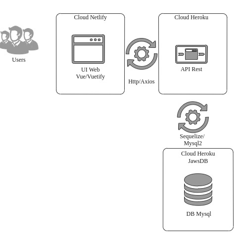

<h1 id="logo" align="center">
  
    
</h1>
<h4 align="center">GrupoA Educação - Full Stack Web Developer</h4>
<h5>App Web:
 <a href="https://grupoa.netlify.app">https://grupoa.netlify.app</a>
</h5>

  <h4>
    
        
    
  </h4>

 
  <h4>
    <a href="#arquitetura">Decisão da arquitetura utilizada</a>
     | 
    <a href="#bibliotecasWeb">
     Lista de bibliotecas de terceiros utilizadas no app web
    </a>      
     | 
     <a href="#bibliotecasService">
     Lista de bibliotecas de terceiros utilizadas no app service
    </a>      
     | 
    <a href="#melhorias">
      O que eu melhoraria se tivesse mais tempo
    </a>  
      | 
    <a href="#requisitos">
      Quais requisitos obrigatórios que não foram entregues
    </a>
  </h4>

###  Arquitetura do App Web e do App Services

 
 

 
 - Arquitetura do projeto web
    - Primeiro a arquitetura de modo geral é a padrão criada pela **CLI** do framework **Vue** automaticamente, conhecida por MVVM, mas foram criada algumas estruturas de pastas que leva o nome do **modelo de domínio** do componente de interface por Exemplo A view da lista de alunos está dentro de **views/Students.vue** e o layout para alunos está dentro de **layouts/Students** onde fica fácil localizar pelo domínio que no caso é o Aluno (Student).
    - componentes: fica todos os componentes que não são responsáveis pela rederização total na tela, mas fazem parte de uma view.
      - alerts: componentes de alerta ao usuário.
      - buttons: componentes de botões que servem para ação, atualmente fazer o usuário ir para outra tela.
      - forms: componentes que servem como entrada de informações por exemplo os dados para registro ou edição do aluno.
      - layouts: fica toda a estrutura que faz a parte externa na tela, sendo usado para abranger algum componente de conteúdo mais específico.
      - tables: componentes que renderiza lista de dados
      - router: onde fica as rotas de acesso as telas da aplicação
      - views: são as telas principais do sistema sendo os componentes compostos de outros componentes.

- Arquitetura do projeto services
    - seguindo com alguns conceitos do DDD temos o software separa em camadas de responsabilidades:
      - repositories: comunicacao com o banco de dados
      - models: modelo para o objeto que será o domínio
      - controllers: manipulação do CRUD
      - config: configurações de banco de dados
      - routers: rotas de acesso ao métodos do controller
    - estrutura de testes
      - tests:  
        - integraçoes: o uso de biblioteca que faz  o papel de cliente e realiza o teste nas rotas da aplicação

### Bibliotecas utilizadas no app web
- vue  
- vue-router
- babel
- cypress
- eslint
- router
- mocha       
- chai        
- vuetify  
- axios
### Bibliotecas utilizadas no app service
- express
- body-parser
- mysql2
- sequelize
- nodemon
- cors
- chai
- chai-http
- mocha

### Melhorias
- Usar **TypeScrip** no projeto web
- Criar mais testes unitários no services
- Criar testes de integração para validar comunicação do App Web com o App services
- Criar mais testes unitários para validar props e data dos componentes, usar testes com snapshot de código para validar alterações no código.
- implementar o swagger como documentação de API com a biblioteca swagger-gen
- usar o cypress para testar a inteface

### Requisitos obrigatórios não entregues
 - Nenhum
### Extras
- Uso da extensão **VS CODE** para containers
    - Documentação para [desenvolver dentro do um container](https://code.visualstudio.com/docs/remote/containers).
    - Após criar o container **Node JS** atualizar com `sudo apt update` instalar o git flow com `sudo apt install git-flow`.
    - Para iniciar o **git flow** usar o `git flow init` e apertar enter para todas as opções que aparecerem, caso queira a configuração padrão.
    - Agora é só seguir com o fluxo de trabalho [git flow](https://www.atlassian.com/br/git/tutorials/comparing-workflows/gitflow-workflow)
- Uso do **pnpm** como gerenciador de pacotes geral do projeto
- Uso de **Monorepo** para controlar demandas de desenvolvimento do projeto e usar dois pacotes separados em **web** e **service**, assim é possivel controlar a partir da raiz do projeto os comandos dos dois pacotes.
  - Exemplo de execução: `pnpm web`  `pnpm service`